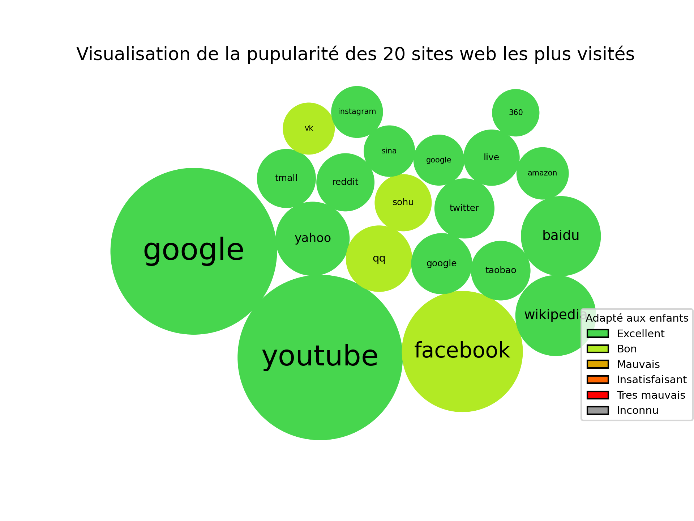
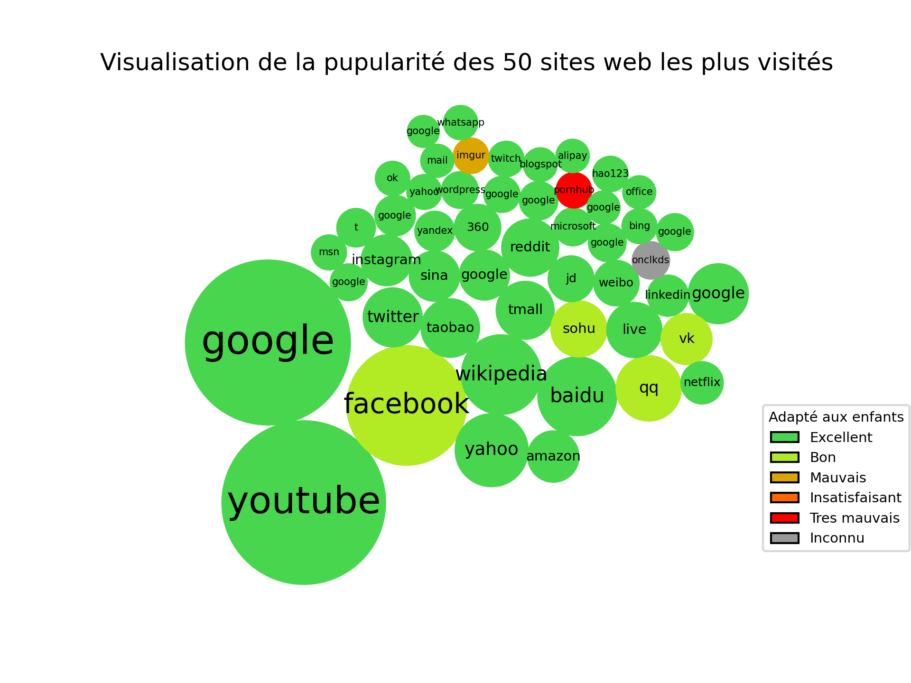
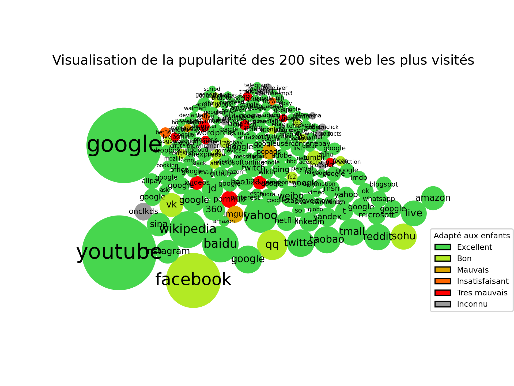

# Visualisation de Popularité des Sites Web

Ce programme génère des graphiques de type bubble chart pour visualiser la popularité de différents sites web en fonction du nombre moyen de visiteurs quotidiens. Les sites web sont colorés en fonction de leur classe de sécurité pour les enfants.

### Prérequis

Avant d'exécuter le programme, assurez-vous d'avoir installé les bibliothèques Python suivantes :

- pandas
- numpy
- matplotlib

Vous pouvez les installer en utilisant pip :

```pip install pandas numpy matplotlib```

### Utilisation

1. Executer le fichier main.py
2. Les graphiques générés seront enregistrés dans le dossier output/

### Exemples des graphiques obtenus

#### 10 sites les plus populaires


#### 20 sites les plus populaires


#### 200 sites les plus populaires

